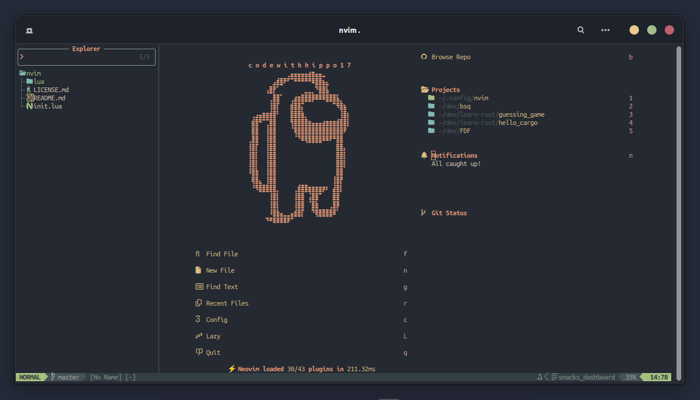
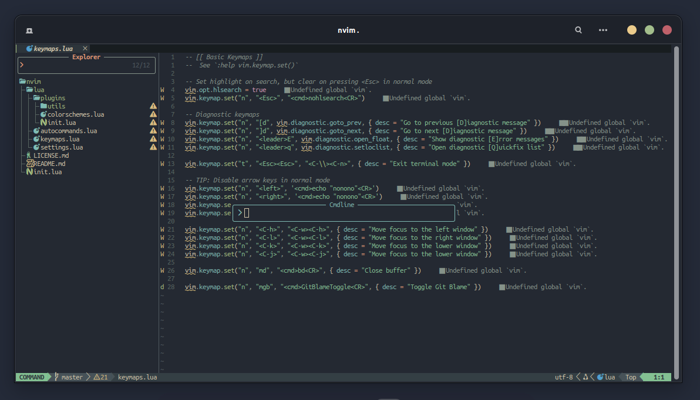
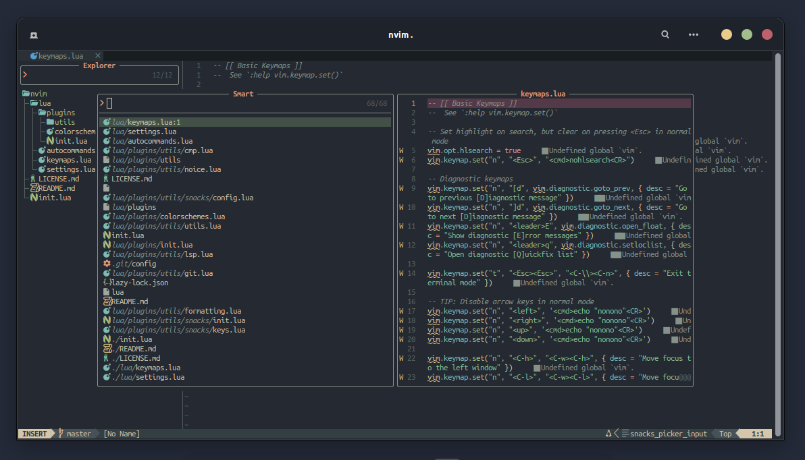

# nvim/

<a href="https://dotfyle.com/codewithhippo17/nvim"></a>
<a href="https://dotfyle.com/codewithhippo17/nvim"></a>
<a href="https://dotfyle.com/codewithhippo17/nvim"></a>
<br>




## Install Instructions

 > Install requires Neovim 0.9+. Always review the code before installing a configuration.

Clone the repository and install the plugins:

```sh
git clone git@github.com:codewithhippo17/nvim ~/.config/codewithhippo17/nvim
```

Open Neovim with this config:

```sh
NVIM_APPNAME=codewithhippo17/nvim/ nvim
```

## Plugins

### color

+ [xiyaowong/transparent.nvim](https://dotfyle.com/plugins/xiyaowong/transparent.nvim)
### colorscheme

+ [catppuccin/nvim](https://dotfyle.com/plugins/catppuccin/nvim)
+ [folke/tokyonight.nvim](https://dotfyle.com/plugins/folke/tokyonight.nvim)
+ [projekt0n/github-nvim-theme](https://dotfyle.com/plugins/projekt0n/github-nvim-theme)
+ [EdenEast/nightfox.nvim](https://dotfyle.com/plugins/EdenEast/nightfox.nvim)
+ [sainnhe/everforest](https://dotfyle.com/plugins/sainnhe/everforest)
### comment

+ [folke/todo-comments.nvim](https://dotfyle.com/plugins/folke/todo-comments.nvim)
+ [numToStr/Comment.nvim](https://dotfyle.com/plugins/numToStr/Comment.nvim)
### completion

+ [hrsh7th/nvim-cmp](https://dotfyle.com/plugins/hrsh7th/nvim-cmp)
### editing-support

+ [folke/snacks.nvim](https://dotfyle.com/plugins/folke/snacks.nvim)
+ [windwp/nvim-ts-autotag](https://dotfyle.com/plugins/windwp/nvim-ts-autotag)
+ [windwp/nvim-autopairs](https://dotfyle.com/plugins/windwp/nvim-autopairs)
### formatting

+ [stevearc/conform.nvim](https://dotfyle.com/plugins/stevearc/conform.nvim)
### fuzzy-finder

+ [nvim-telescope/telescope.nvim](https://dotfyle.com/plugins/nvim-telescope/telescope.nvim)
### git

+ [NeogitOrg/neogit](https://dotfyle.com/plugins/NeogitOrg/neogit)
+ [lewis6991/gitsigns.nvim](https://dotfyle.com/plugins/lewis6991/gitsigns.nvim)
+ [f-person/git-blame.nvim](https://dotfyle.com/plugins/f-person/git-blame.nvim)
+ [sindrets/diffview.nvim](https://dotfyle.com/plugins/sindrets/diffview.nvim)
### icon

+ [kyazdani42/nvim-web-devicons](https://dotfyle.com/plugins/kyazdani42/nvim-web-devicons)
+ [echasnovski/mini.icons](https://dotfyle.com/plugins/echasnovski/mini.icons)
+ [nvim-tree/nvim-web-devicons](https://dotfyle.com/plugins/nvim-tree/nvim-web-devicons)
### keybinding

+ [folke/which-key.nvim](https://dotfyle.com/plugins/folke/which-key.nvim)
### lsp

+ [neovim/nvim-lspconfig](https://dotfyle.com/plugins/neovim/nvim-lspconfig)
+ [j-hui/fidget.nvim](https://dotfyle.com/plugins/j-hui/fidget.nvim)
### lsp-installer

+ [williamboman/mason.nvim](https://dotfyle.com/plugins/williamboman/mason.nvim)
### nvim-dev

+ [nvim-lua/plenary.nvim](https://dotfyle.com/plugins/nvim-lua/plenary.nvim)
+ [folke/neodev.nvim](https://dotfyle.com/plugins/folke/neodev.nvim)
+ [MunifTanjim/nui.nvim](https://dotfyle.com/plugins/MunifTanjim/nui.nvim)
### plugin-manager

+ [folke/lazy.nvim](https://dotfyle.com/plugins/folke/lazy.nvim)
### search

+ [nvim-pack/nvim-spectre](https://dotfyle.com/plugins/nvim-pack/nvim-spectre)
### snippet

+ [L3MON4D3/LuaSnip](https://dotfyle.com/plugins/L3MON4D3/LuaSnip)
### statusline

+ [nvim-lualine/lualine.nvim](https://dotfyle.com/plugins/nvim-lualine/lualine.nvim)
### syntax

+ [nvim-treesitter/nvim-treesitter](https://dotfyle.com/plugins/nvim-treesitter/nvim-treesitter)
### tabline

+ [akinsho/bufferline.nvim](https://dotfyle.com/plugins/akinsho/bufferline.nvim)
### utility

+ [folke/noice.nvim](https://dotfyle.com/plugins/folke/noice.nvim)
## Language Servers

+ clangd
+ html
+ lua_ls
+ pyright
+ rust_analyzer
+ solargraph


 This readme was generated by [Dotfyle](https://dotfyle.com)


